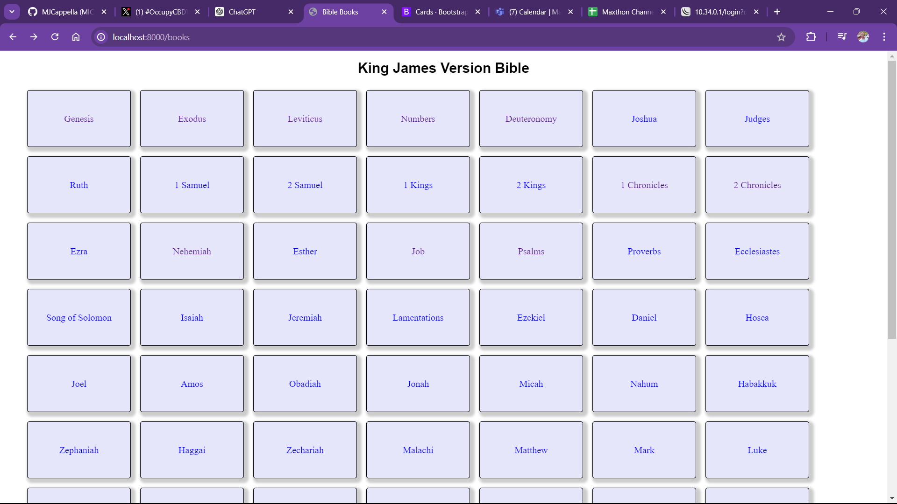

# Laravel Bible

  A King James Version Bible web application built using Laravel and Blade templates. It includes a search functionality that allows users to search for specific texts from the Bible and results are given in the form of the Book where the result has been found, its chapter and the verse. 

    <h2>TO DO:</h2>
    <ul>
        <li>
            Add an AI search engine feature for detailed explanations.
        </li>
        <li>
            Implement an intelligent search bar with Regex.
        </li>
        <li>
            Contributions  to the above are welcomed.
        </li>
    </ul>

